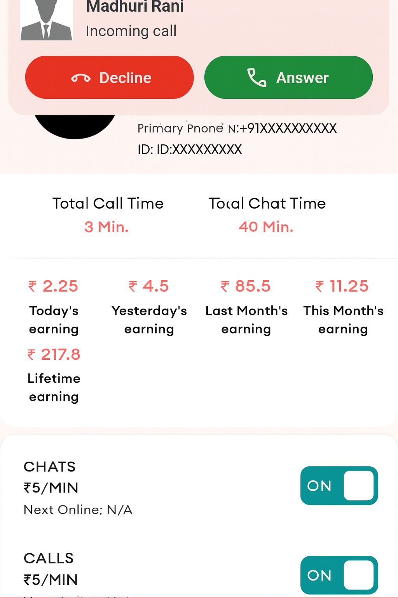

# zastro_android_call_notifications

## Getting Started

This project is a starting point for a Flutter
[plug-in package](https://flutter.dev/to/develop-plugins),
a specialized package that includes platform-specific implementation code for
Android.

For help getting started with Flutter development, view the documentation below:

A Flutter plugin to trigger call and microphone
notifications — including:

- **Incoming ringing call notifications** with ringtone and vibration
- **Ongoing call UI** with call timer updates
- **Microphone recording indicators**

Built for apps that require custom **VoIP-style UI** using foreground services.

## Features

✅ Incoming call notifications with a WhatsApp-style full screen call UI  
✅ Works while the app is backgrounded, terminated, or the device is locked  
✅ Ongoing call notification with timer  
✅ Mic recording notification with persistent indicator   
✅ Foreground service support for Android 10+

## Screenshot

## Getting Started

1. Add dependency

dependencies:
zastro_android_call_notifications: ^<latest_version>

2. Import the package

3. Example usage

    ///Important Permissions for Notifications
    Future<void> requestImportantPermissions() async {
    Map<Permission, PermissionStatus> statuses = await [
    Permission.phone, // For CALL & FOREGROUND_SERVICE_PHONE_CALL
    // Permission.manageExternalStorage, // For MANAGE_OWN_CALLS (optional)
    Permission.notification, // For POST_NOTIFICATIONS (Android 13+)
    Permission.microphone,
    ].request();
    
    statuses.forEach((permission, status) {
    debugPrint('$permission: $status');
    });
    
    if (await Permission.phone.isDenied ||
    await Permission.notification.isDenied ||
    await Permission.microphone.isDenied) {
    debugPrint('Some permissions were denied. App may not function properly.');
    }
    }
    
    void handleCallResponse(Map<String, dynamic> data, String responseText) {
    Get.to(() => NotificationResponseScreen(NotificationResponseModel(
    data['uniqueId'],
    data['customerUniId'],
    data['caller_name'],
    data['caller_image'],
    data['notificationId'],
    responseText,
    data['type'])));
    }
    
    void setupMethodChannel() {
    channel.setMethodCallHandler((call) async {
    if (call.method == "onCallAction") {
    // Explicitly casting call.arguments to avoid type issues
    final Map<String, dynamic>? data = call.arguments != null
    ? Map<String, dynamic>.from(call.arguments as Map)
    : null;
    
          debugPrint("Android data : $data");
    
          if (data != null) {
            if (data['type'] == "chat") {
              if (data['action'] == "ACTION_ANSWER_CALL") {
                debugPrint("Call Accepted: ${data['caller_name']}");
                handleCallResponse(data, "ACCEPT CHAT");
              } else if (data['action'] == "ACTION_DECLINE_CALL") {
                debugPrint("Call Declined");
                handleCallResponse(data, "REJECT CHAT");
              } else if (data['action'] == "CALL_NOTIFICATION_CLICK") {
                Get.toNamed('/chatRequest');
              }
            }
            else if (data['type'] == "video") {
              if (data['action'] == "ACTION_ANSWER_CALL") {
                debugPrint("Call Accepted: ${data['caller_name']}");
                handleCallResponse(data, "ACCEPT VIDEO");
              } else if (data['action'] == "ACTION_DECLINE_CALL") {
                debugPrint("Call Declined");
                handleCallResponse(data, "REJECT VIDEO");
              } else if (data['action'] == "CALL_NOTIFICATION_CLICK") {
                Get.toNamed('/videoRequest');
              }
            }
            else if (data['type'] == "call") {
              if (data['action'] == "ACTION_ANSWER_CALL") {
                debugPrint("Call Accepted: ${data['caller_name']}");
                handleCallResponse(data, "ACCEPT CALL");
              } else if (data['action'] == "ACTION_DECLINE_CALL") {
                debugPrint("Call Declined");
                handleCallResponse(data, "REJECT CALL");
              } else if (data['action'] == "CALL_NOTIFICATION_CLICK") {
                Get.toNamed('/voiceRequest');
              }
            }
          }
        }
        return null;
    
    });
    }
    
    if (Platform.isAndroid) {
    await ChatNotificationPlugin.showCallNotification({
    "type": type,
    'uniqueId': uniqueId,
    "customerUniId": customerUniId,
    "notificationId": notificationId,
    "caller_name": customerName,
    "caller_image": customerImage,
    "message_data_in_string": jsonString,
    }); ///Show call notification
    }
    
    else if (type == "cancel") {
    if (Platform.isAndroid) {
    await ChatNotificationPlugin.cancelCallNotification(notificationId); ///Cancel Notification
    } else {
    // cancelNotification(notificationId);
    }
    }
    
    if(Platform.isAndroid){
    await ChatNotificationPlugin.triggerBroadcastNotification(
    jsonEncode(message.data)); ///background call
    }
    
    else if (type == "cancel") {
    if(Platform.isAndroid){
    await ChatNotificationPlugin.triggerBroadcastNotification(
    jsonEncode(message.data)); ///Cancel Notification
    } else {
    // cancelNotification(notificationId);
    }
    }

Android Setup
Required for foreground service and notification permissions.

AndroidManifest.xml

    <uses-permission android:name="android.permission.POST_NOTIFICATIONS" />
    <uses-permission android:name="android.permission.FOREGROUND_SERVICE" />
    <uses-permission android:name="android.permission.FOREGROUND_SERVICE_PHONE_CALL" />
    <uses-permission android:name="android.permission.MANAGE_OWN_CALLS" />

    <uses-permission android:name="android.permission.RECORD_AUDIO" />
    <uses-permission android:name="android.permission.FOREGROUND_SERVICE_MICROPHONE" />
    <uses-permission android:name="android.permission.FOREGROUND_SERVICE_MEDIA_PLAYBACK" />

## Full screen incoming call screen

Since `0.0.11` the incoming call notification opens a full screen call screen
(caller photo, name, call type, Accept / Decline) instead of only showing a
heads-up notification. It shows over the lock screen and turns the screen on, so
it works while the app is in the background, terminated, or the device is asleep.

Nothing has to change in the host app. Accept and Decline fire the exact same
`PendingIntent`s the notification's own action buttons already carried, so the
`onCallAction` / launch-intent handling shown above keeps working unchanged.

Note that Android only launches a full screen intent when the device is locked or
idle. If the user is actively using the device, the system shows the heads-up
call notification instead — this is Android's documented behaviour and is what
WhatsApp and the system dialer do as well.

### Android 14 (API 34) and above

Android 14 turned `USE_FULL_SCREEN_INTENT` into a user-revocable special access.
When it is revoked the call still rings, but Android silently downgrades it to a
heads-up notification and the full screen screen never appears. Two helpers are
provided so the host app can detect and repair that:

    /// true on Android 13 and below, where the permission is implicit.
    final allowed = await ChatNotificationPlugin.canUseFullScreenIntent();

    if (!allowed) {
      // Opens the system "Full screen notifications" page for your app.
      // Returns false if nothing on the device handles the intent.
      await ChatNotificationPlugin.openFullScreenIntentSettings();
    }

Call this once, next to your other permission requests. Do not call it on every
cold start — persist a flag so the user is never repeatedly dropped into Settings.

`USE_FULL_SCREEN_INTENT` is declared by the plugin's own manifest, so no extra
entry is needed in the host app's `AndroidManifest.xml`.

## Custom ringtone

Incoming calls ring from the plugin's own player, on a dedicated **silent**
notification channel (`zastro_incoming_call`). That is what makes a custom
ringtone possible: a notification channel's sound is fixed when the channel is
created and cannot be changed afterwards.

A ringtone can be set three ways. Highest precedence first:

1. **Per call** — `showCallNotification({... 'ringtone': '<spec>'})`
2. **Per call from the server** — a `ringtone` field in the FCM data payload.
   This is the one that applies when the app is dead, because that path never
   reaches Dart.
3. **App-wide** — `ChatNotificationPlugin.setDefaultRingtone('<spec>')`,
   persisted natively so it survives process death. Call it once during startup.

Accepted values for `<spec>`:

    null / '' / 'default'          system ringtone
    'assets/sounds/ring.mp3'       Flutter asset (declare it under flutter: assets:)
    'raw/ring' or 'ring'           android/app/src/main/res/raw/ring.mp3
    'https://…', 'content://…',
    'file://…'                     any uri
    '/storage/emulated/0/ring.mp3' absolute path

Anything that cannot be resolved falls back to the system ringtone, so a wrong
value can never leave an incoming call silent. Resolution is logged under the
`ZastroRingtone` tag.

## Notification appearance

    await ChatNotificationPlugin.setCallNotificationAppearance(
      smallIcon: 'ic_notification',   // drawable name in the host app
      accentColor: '#FF6B00',         // tints the icon and action buttons
      colorized: false,               // paint the whole notification: opt-in
    );

Stored natively, so it also applies to calls raised from a data-only FCM payload.
Call it once during startup.

`smallIcon` **must be a monochrome notification icon**, never the colour launcher
icon: Android draws a small icon from its alpha channel alone and discards the
colour, so a fully opaque icon renders as a solid blob. When omitted the plugin
looks for `ic_notification`, `ic_stat_notification` and `ic_stat_name` in the
host app before falling back to its own icon.

`colorized` is off by default because a light brand colour makes the notification
text unreadable. Check it on a real device before enabling it.

